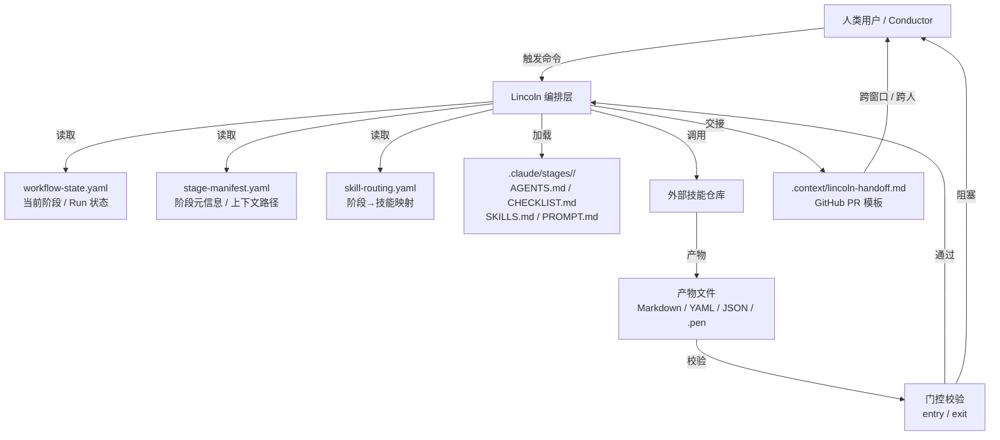

# Lincoln 框架设计

本文档定义 Lincoln 的元模型、能力边界与编排机制。Lincoln 是**顶层编排层**，OpenSpec、Superpowers、Everything-Claude-Code、oh-my-claudecode、GSD 是**能力支持层**。

---

## 元模型定义

### Stage（阶段）

工作流中的独立执行单元，有明确的准入、执行、准出规则。

| 字段 | 类型 | 说明 |
|------|------|------|
| `id` | string | 唯一标识，如 `clarify`、`implement` |
| `name` | string | 人类可读名称 |
| `human_gate` | boolean | 是否需要人类 PM 确认后才能进入下一阶段 |
| `template` | string | 所属工作流模板 |
| `prerequisite_stage` | string | 前置阶段 ID |
| `required_artifacts` | string[] | 准入时必须存在的产物文件路径 |
| `required_skills` | string[] | 本阶段必须加载的技能（引用 `skill-routing.yaml`） |
| `agents_md_path` | string | 阶段专属 Agent 上下文文件路径 |

**关系**：Stage 按顺序串联，形成工作流模板。每个 Stage 有独立的 `.claude/stages/<stage>/` 目录存放上下文。

### Gate（门控）

控制阶段流转的校验点，分为两类：

- **准入门控（Entry Gate）**：进入阶段前校验前置产物、技能依赖、状态一致性。
- **准出门控（Exit Gate）**：阶段完成后校验产物完整性、人类确认、技能调用记录。

| 字段 | 类型 | 说明 |
|------|------|------|
| `type` | enum | `entry` / `exit` |
| `checklist` | string[] | 校验项清单 |
| `validator` | string | 校验脚本路径 |
| `blocking` | boolean | 失败时是否阻止继续 |

### Artifact（产物）

阶段执行过程中生成的文件化输出，是跨阶段、跨角色交接的核心载体。

| 字段 | 类型 | 说明 |
|------|------|------|
| `path` | string | 文件相对路径 |
| `stage` | string | 生成该产物的阶段 ID |
| `required_by` | string[] | 下游阶段 ID 列表 |
| `format` | enum | `markdown` / `yaml` / `json` / `pen` / `drawio` |
| `human_confirm` | boolean | 是否需要人类确认后生效 |

### Skill（技能）

外部能力仓库提供的子技能或方法论插件，通过路由框架动态绑定到阶段。

| 字段 | 类型 | 说明 |
|------|------|------|
| `id` | string | 技能标识，如 `superpowers:brainstorming` |
| `domain` | enum | `openspec` / `superpowers` / `ecc` / `oh-my-claudecode` / `gsd` |
| `capability` | string | 能力描述 |
| `trigger_stages` | string[] | 默认绑定的阶段 |
| `required` | boolean | 是否必须加载 |

### Role（角色）

使用 Lincoln 的人类或 Agent 身份，决定可见阶段、命令权限、产物责任。

| 角色 | 主要职责 | 典型阶段 |
|------|----------|----------|
| PM | 需求澄清、设计确认、门控裁决 | `clarify`、`product-design-docs`、`product-prototype` |
| Designer | UI/UX 设计、原型输出 | `product-prototype` |
| Engineer | 实现、测试、代码审查 | `implement`、`test/verify` |
| Tech Lead | 架构决策、技术可行性、跨阶段协调 | 全阶段 |
| Workflow Developer | 模板开发、技能路由配置、框架升级 | `sync-knowledge`、元模型维护 |

### Template（模板）

预定义的工作流阶段序列，根据项目上下文选择。

| 模板 ID | 适用场景 | 阶段序列 |
|---------|----------|----------|
| `interview-to-knowledge` | 新需求，有访谈录音 | `workflow-router` → `ingest` → `clarify` → `product-design-docs` → `product-prototype` → `tdd-development-plan` → `propose` → `split` → `implement` → `test/verify` → `ship` → `sync-knowledge` |
| `existing-project-iteration` | 已有源码，知识库为空 | `workflow-router` → `ingest` → `clarify` → `product-design-docs` → ... |
| `bug-fix` | 明确 bug/issue | `workflow-router` → `clarify` → `tdd-development-plan` → `implement` → `test/verify` → `ship` → `sync-knowledge` |
| `design-spike` | 方案预研 | `workflow-router` → `clarify` → `product-design-docs` → `product-prototype` / `tdd-development-plan`（终止） |
| `oss-first-design` | 强依赖开源方案 | `workflow-router` → `clarify` → `lincoln-explore-opensource` → `product-design-docs` → ... |

### Run（执行实例）

一次完整的工作流执行，从模板选择到知识同步。

| 字段 | 类型 | 说明 |
|------|------|------|
| `id` | string | 唯一标识，通常与分支名关联 |
| `template` | string | 使用的模板 ID |
| `current_stage` | string | 当前阶段 ID |
| `completed_stages` | string[] | 已完成阶段 |
| `artifacts` | Artifact[] | 已生成产物 |
| `metrics` | object | 阶段数、耗时、人工门控数、校验失败数 |
| `started_at` | timestamp | 启动时间 |
| `last_updated_at` | timestamp | 最后更新时间 |

### Branch（分支）

Git 分支作为工作流隔离单元，每个需求独立分支，状态文件随分支提交。

| 字段 | 类型 | 说明 |
|------|------|------|
| `name` | string | 分支名，格式 `lincoln/<session-id>-<design-id>` |
| `run` | Run | 绑定到该分支的执行实例 |
| `state_file` | string | `.claude/workflow-state.yaml` 路径 |
| `handoff_report` | string | `.context/lincoln-handoff.md` 路径 |

---

## 能力边界

Lincoln 不替代任何专业工具，而是决定"在哪个阶段用哪种能力"。

### OpenSpec（变更提案与任务管理）

- **职责**：变更提案生成、设计文档、任务拆分、规格同步、归档。
- **Lincoln 中的位置**：`propose` 阶段的核心能力，`clarify` / `product-design-docs` 阶段的可选探索能力。
- **边界**：不处理需求访谈、UI 原型、代码实现。

### Superpowers（方法论子技能）

- **职责**：会话启动感知、头脑风暴、计划结构化、TDD 约束、子 Agent 并行、系统调试、代码审查、完成前验证。
- **Lincoln 中的位置**：贯穿所有阶段的方法论插件，尤其在 `clarify`、`implement`、`test/verify` 阶段高频调用。
- **边界**：不替代 Lincoln 的阶段定义和门控机制。

### Everything-Claude-Code（引擎与 Hooks 层）

- **职责**：强制执行阶段校验、限制副作用工具、追踪产物、会话启动加载上下文。
- **Lincoln 中的位置**：所有阶段的底层约束层，通过 `pre-tool-use.sh`、`post-tool-use.sh`、`on-session-start.sh` 拦截和记录。
- **边界**：不定义业务逻辑，只执行 Lincoln 声明的规则。

### oh-my-claudecode（多 Agent 编排与增强模式）

- **职责**：复杂阶段规划、多 Agent 并行协作、独立验证、自主执行、深度访谈、知识库维护。
- **Lincoln 中的位置**：`implement` 阶段的并行实施、`clarify` 阶段的深度访谈、`sync-knowledge` 阶段的知识沉淀。
- **边界**：作为可选能力支持层，不强制依赖。

### GSD（项目生命周期管理）

- **职责**：项目初始化、里程碑管理、阶段规划、MVP 切片、UI 设计合约、AI 功能设计、执行、验证、Ship、审计、失败诊断。
- **Lincoln 中的位置**：`workflow-router` 阶段的项目初始化、`tdd-development-plan` 阶段的计划生成、`implement` 阶段的执行、`ship` 阶段的 PR 创建。
- **边界**：不替代 Lincoln 的访谈处理、Pencil 原型、OpenSpec 提案。

---

## 编排机制

### skill-routing.yaml

机器可读的技能路由表，定义每个阶段的 required / optional / human_gate 技能映射。

```yaml
routing:
  clarify:
    required: [superpowers:brainstorming]
    optional: [gsd:import, gsd:discuss-phase, oh-my-claudecode:deep-interview, openspec:explore]
    human_gate: true
  implement:
    required: [superpowers:test-driven-development, superpowers:verification-before-completion]
    optional: [openspec:apply-change, superpowers:subagent-driven-development, gsd:execute-phase, oh-my-claudecode:team]
    human_gate: true
```

Agent 通过 `scripts/lincoln-status.py` 读取当前阶段，从 `skill-routing.yaml` 获取推荐技能列表。

### stage-manifest.yaml

阶段清单，索引所有阶段元信息，让 Agent 和人类快速定位当前阶段上下文。

```yaml
stages:
  - id: clarify
    name: 需求澄清
    human_gate: true
    template: interview-to-knowledge
    prerequisite_stage: ingest
    required_artifacts: [interviews/<session>/summary.md]
    required_skills: [superpowers:brainstorming]
    agents_md_path: .claude/stages/clarify/AGENTS.md
  - id: implement
    name: 研发实现
    human_gate: true
    template: interview-to-knowledge
    prerequisite_stage: split
    required_artifacts: [openspec/changes/<change>/tasks.md]
    required_skills: [superpowers:test-driven-development, superpowers:verification-before-completion]
    agents_md_path: .claude/stages/implement/AGENTS.md
```

### 启动自检流程

Agent 进入会话时：

1. 运行 `python scripts/lincoln-status.py --format markdown`
2. 读取 `.claude/workflow-state.yaml`、`stage-manifest.yaml`、当前阶段 4 个上下文文件
3. 运行 `scripts/stage_loader.py --stage <stage> --action validate-entry`
4. 每次回复人类前简要汇报：当前阶段、已加载上下文、使用的技能、产物状态

---

## 数据流图



### ASCII 版流程

```
用户/Conductor
      |
      v
+----------------------------------+
| Lincoln 编排层                   |
|  - workflow-state.yaml (状态)    |
|  - stage-manifest.yaml (阶段)    |
|  - skill-routing.yaml (技能路由) |
+----------------------------------+
      |
      +---> 加载阶段上下文 (AGENTS.md / CHECKLIST.md / SKILLS.md / PROMPT.md)
      |
      +---> 调用外部技能
      |         - OpenSpec: 变更提案
      |         - Superpowers: 方法论
      |         - ECC: 引擎约束
      |         - oh-my-claudecode: 多 Agent
      |         - GSD: 项目生命周期
      |
      v
产物文件 (Markdown / YAML / JSON / .pen)
      |
      v
门控校验 (entry / exit)
      |
      +---> 通过 → 继续下一阶段
      +---> 阻塞 → 等待人类确认
      |
      v
交接文档 (.context/lincoln-handoff.md)
      |
      v
跨窗口 / 跨人 / GitHub PR
```

---

## 核心设计原则

1. **文件即真相**：状态、进度、配置、技能路由全部文件化，便于 Git 版本控制与跨窗口/跨人机交接。
2. **阶段即契约**：每个阶段有明确的准入、执行、准出、人工门控、产物、技能清单。
3. **Lincoln 编排，能力下沉**：Lincoln 决定"在哪个阶段用哪种能力"，具体技能由各自仓库实现。
4. **启动即自检**：Agent 进入会话时，先运行状态命令，自动汇报当前阶段与所需上下文。
5. **可审计**：审计脚本验证状态一致性、产物完整性、门控合规性。
